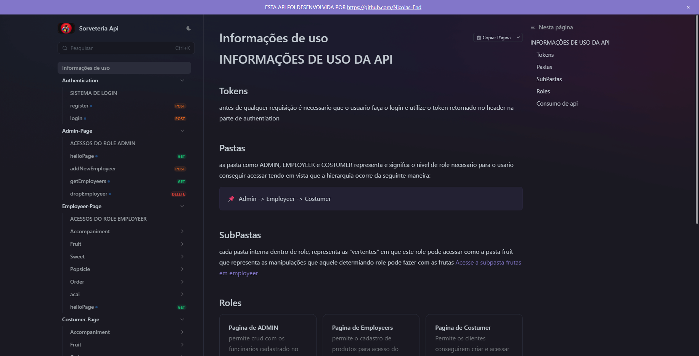

<center>

# Sorveteria Api 


</center>


<p>A Sorveteria API é um projeto de back-end desenvolvido por mim com o objetivo 
de simular o funcionamento de uma sorveteria fictícia, criada para fins de 
estudo e prática. A aplicação permite que administradores e funcionários 
realizem o gerenciamento de produtos, como picolés e acompanhamentos de 
açaí, enquanto os clientes podem efetuar pedidos de picolés e montar seus 
açaís de acordo com suas próprias preferências, escolhendo os ingredientes 
desejados. O projeto foi desenvolvido seguindo boas práticas de 
desenvolvimento de APIs REST, com foco em organização, regras de negócio e 
simulação de um cenário real de aplicação comercial.<p>

--- 
--- 
## INSTRUÇÃO DE INSTALAÇÃO E USO 
- ### Pré Requsitos
  -   git
  -   Docker
  -   Docker compose
  -   Consumidor de Api exemplo: apiDog, Postman, etc
---
- ### Etapas
  - Abra o terminal e execute o seguinte comando para clonar o repositório e acessar o diretório do projeto:
  ````bash 
    git clone https://github.com/Nicolas-End/SorveteriaApi && cd SorveteriaApi
  ````
  -  Em seguida, construa e inicie os serviços definidos no Docker Compose com o comando:
  ````bash 
    docker-compose up
  ````
---
- ### Instrução de uso  após instalação

  - Abra o seu cliente de API de preferência.

  - Acesse a documentação da API através do link fornecido abaixo.

  - Realize as requisições conforme indicado na documentação.

  - Inicie pelo endpoint de register/admin e crie uma conta dps o enpoint login, que retornará um token necessário para autenticar as requisições subsequentes.

###### imagem ilustratica do meu docks
<center> 

[clique aqui para acessar meu docks](https://lhfkl1lkiu.apidog.io/informa%C3%A7%C3%B5es-de-uso-1880008m0)

</center>

---
---
## ENDPOINTS DA API

**URL_BASE:** `http://localhost:8080`

---

### Autenticação

- **POST** `/register` ou `/register/admin`  
  Cria um novo usuário ou administrador no sistema.

- **POST** `/login`  
  Retorna um token válido por até 2 horas.

---

### Administração de funcionários (Admin)

- **POST / GET** `/admin/employer`  
  - POST: Cria um novo funcionário.  
  - GET: Retorna todos os funcionários cadastrados.

- **DELETE / UPDATE / GET** `/admin/employer/{id}`  
  - DELETE: Apaga um funcionário do sistema.  
  - PUT/UPDATE: Edita os dados de um funcionário.  
  - GET: Retorna os dados de um funcionário específico.

---

### Pedidos de Açaí (Funcionário)

- **GET** `/employer/acai`  
  - GET: Retorna todos os pedidos de açaí dos usuários.

- **GET / PUT** `/employeer/order` e `/order/{id}`  
  - GET: Retorna todos os pedidos pendentes dos usuários.  
  - PUT: Permite ao funcionário modificar o status de um pedido específico.

---

### Sorvetes (Funcionários)

- **POST / PUT / DELETE** `/popsicle` e `/popsicle/{id}`  
  - GET: Retorna todos os sorvetes criados.  
  - POST: Adiciona um novo sorvete.  
  - DELETE: Exclui um sorvete específico
---
### Adicionais Açai (Funcionarios)
- **POST / PUT / DELETE** `/fruit`, `/sweet`, `/accompaniment` e `/fruit/{id}`, `/sweet/{id}`, `/accompaniment/{id}`  
 
  - POST: Adiciona um novo adicional.  
  - DELETE: Exclui um adicional específico.

---
### Adicionais Açai e Sorvetes (Clientes)
- **GET**  `/popsicle`, `/fruit`, `/sweet`, `/accompaniment` e `/fruit/{id}`, `/sweet/{id}`, `/accompaniment/{id}`
    - GET: Retorna todos os sorvetes ou adicionais(frutas, doces ou acompanhamentos). 
    - GET {id}: Retorna os dados de um sorvete ou adicional em especifico
---
### Açai (Clientes)
- **GET / POST / DELETE** `/acai` e `/acai/{id}`
  - GET: Retorna todos os seus pedidos de açai cadastrados
  - GET{id}: Retorna os dados especificos de um determinado açai
  - POST: Adiciona um novo pedido açai no banco de dados
  - DELETE: Deleta um pedido de açai caso seja concluido ou feito errado pelo id
---
### Pedidos de Sorvete (Clientes)
- **GET / POST / DELETE** `/order` e `/order/{id}`
  - GET: Retorna todos os seus pedidos de sorvetes cadastrados
  - GET{id}: Retorna os dados especificos de um determinado pedido
  - POST: Adiciona um novo pedido no banco de dados
  - DELETE: Deleta um pedido caso seja concluido ou feito errado pelo id

---
---

###### Obs para features futuras colocar cache para optimizar a api
